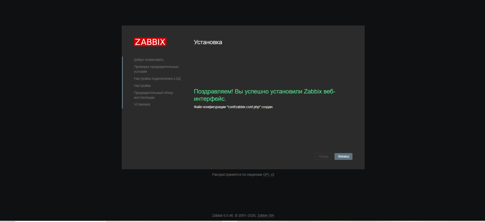
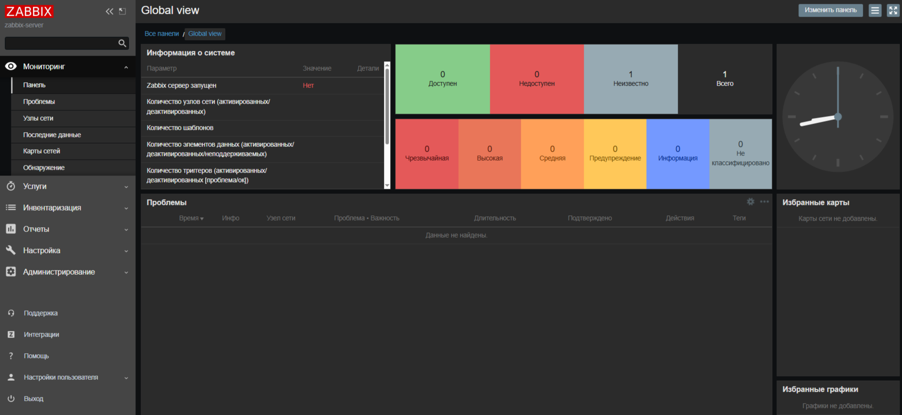
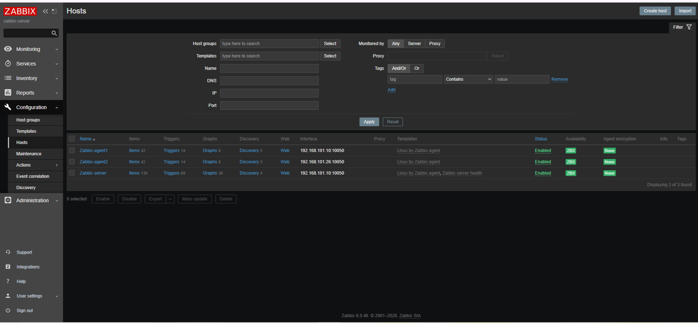
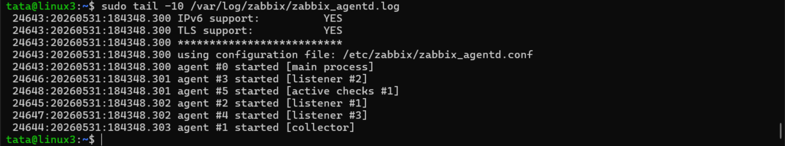
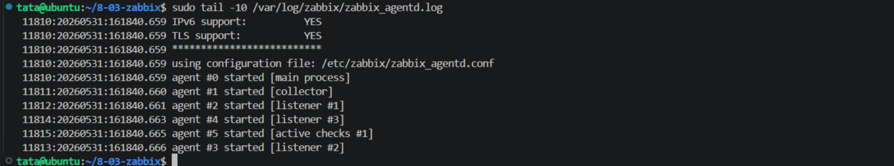
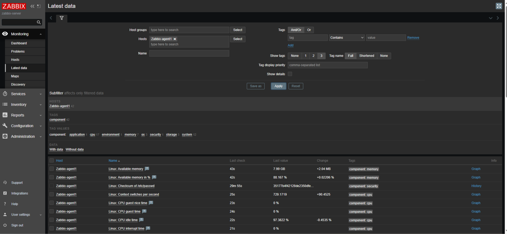
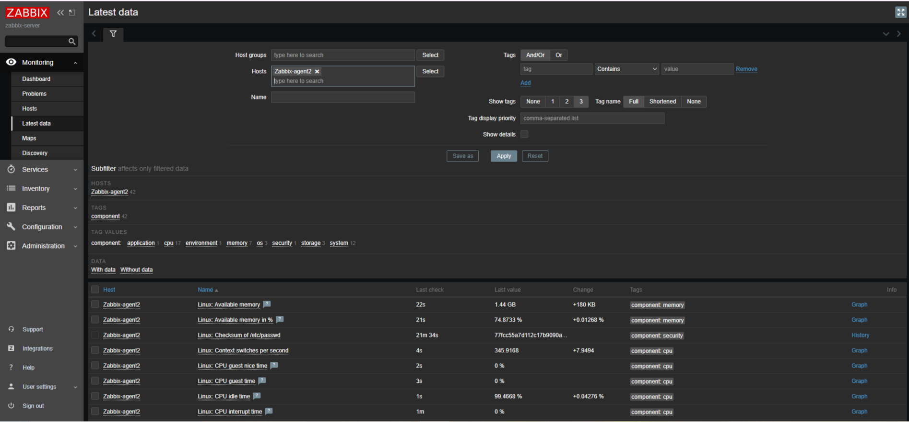
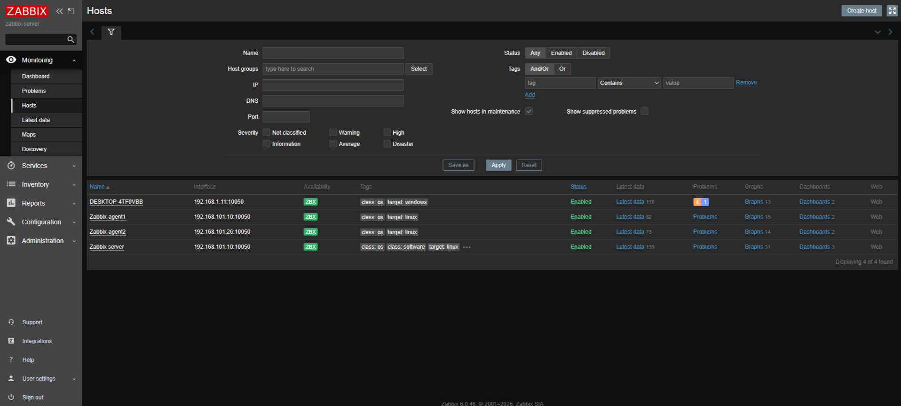
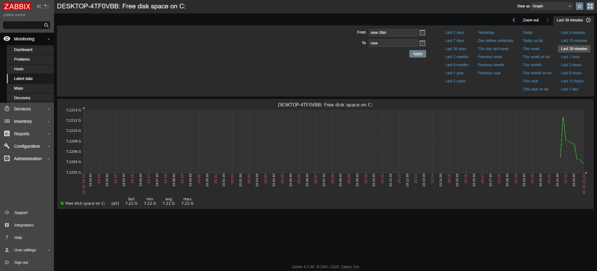

###  Домашнее задание к занятию «Система мониторинга Zabbix» - Фабричникова Татьяна

###  Задание 1


Я надеюсь не будет считаться за ошибку то, что устанавливала не на debian , а на ubuntu.

  - С помощью шаблонов с сайта zabbix.com ,установила на первую вм Zabbix Server с веб-интерфейсом.
  - Установила postgresql 

  ```
  sudo apt update
  sudo apt install postgresql -y
  ```

В файле /etc/zabbix/zabbix_server.conf раскомментировала порт 10050, проверила пароль.

 

>Установка zabbix веб-интерфейса


>Стартовая страницы
>Здесь сервер не активен, напутала с паролями postgres, и сервер не мог подключиться к базе данных.


### Задание 2

Установила на первую вм (где сервер агент):
```
apt install  zabbix-agent
```

Со второй машиной проделала все команды , что в первом задании, но в моменте apt install установила только zabbix-agent

В файлaх /etc/zabbix/zabbix_agentd.conf на обоих машинах добавила ip сервера в строки  "Server" "ServerActive" , и в "Hostname" - прописала имена агентов как в веб-интерфейсе


>Статусы сервера и агентов


>Подключение агента1 к серверу


>Подключение агента2 к серверу


>Поступающие метрики для агента1


>Поступающие метрики для агента2


###  Задание 3 со звёздочкой*
Установите Zabbix Agent на Windows (компьютер) и подключите его к серверу Zabbix.


>Список агентов и сервер


>Свободное мето на диске С